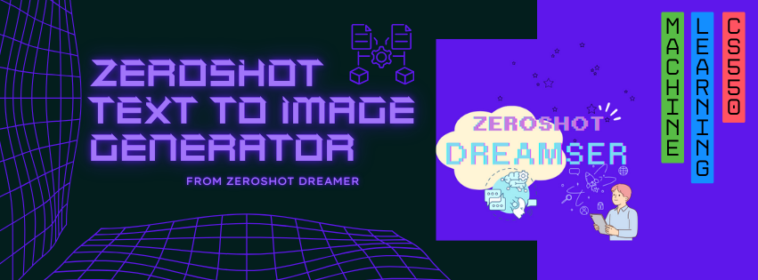

# Zeroshot Text-to-ImageAI

     

&nbsp;

### Course: CS550 Machine Learning, IIT Bhilai  
### Group Name: Zeroshot Dreamers

### Project Title: Zero-shot Text-to-Image Generator

&nbsp;

## Project Overview

Text-to-ImageAI is a deep learning-based project focused on generating images from textual descriptions in a zero-shot learning setting. This project aims to develop a generative model that can understand and interpret natural language to create high-quality images without requiring pre-labeled datasets. The model uses state-of-the-art techniques in generative adversarial networks (GANs) and transformer-based architectures to achieve realistic image synthesis.

&nbsp;

## Presentation 

## Team Members

- Nitin Mane  
- Himanshu Rana  
- Deepak Kumar  
- Mahesh Kesgire  
- Mohd Mukheet

&nbsp;

## Features
- **Zero-Shot Learning**: Generates images based on text prompts without requiring labeled training examples for those categories.
- **Transformer Integration**: Uses transformer-based models to understand and process natural language input.
- **GAN-based Image Generation**: Employs Generative Adversarial Networks for producing high-quality images.

&nbsp;

## Introduction

The ZeroShot Text-to-Image Generator aims to explore the intersection of computer vision and natural language processing by generating high-quality images from textual descriptions. This approach relies on deep learning, specifically leveraging zero-shot learning, generative adversarial networks (GANs), and transformer-based architectures. Unlike conventional methods that require large labeled datasets, this project focuses on generating images without direct supervision, making it a promising tool for a wide range of applications.

This project is an academic effort under the CS550 Machine Learning course at IIT Bhilai. It addresses the challenges of text-to-image translation by using advanced deep learning techniques, which can produce creative and visually appealing content based on textual input. The primary focus is on developing a model that demonstrates high versatility in generating realistic visuals from unseen categories during the training process.

&nbsp;

## Problem Statement

Generating images from textual descriptions is a complex challenge due to the differences in representation between text and images. Text is a sequential data type, whereas images are typically represented as a grid of pixels, each carrying spatial information. This modality difference makes it challenging for traditional models to generate coherent and contextually accurate images from textual prompts. Additionally, obtaining large-scale labeled datasets to train such models is resource-intensive and not feasible in many scenarios.

The ZeroShot Text-to-Image Generator project aims to overcome these issues by employing zero-shot learning techniques. These techniques allow the model to generalize to unseen categories by understanding latent relationships between text and images. By leveraging a combination of transformer models for text encoding and GANs for image generation, the model can produce realistic visuals from a wide range of descriptive prompts without requiring direct examples during training.

&nbsp;

## Motivation

The primary motivation for developing the ZeroShot Text-to-Image Generator is to advance generative modeling capabilities and bridge the gap between text and image representations. Traditional image generation methods depend heavily on labeled datasets, which can be costly and time-consuming to collect. Zero-shot learning eliminates this dependence, offering a more scalable solution to generating novel visual content.

Another motivation is the potential applications of this technology in various domains, such as content creation, design, and education. By providing an open-source implementation, we hope to encourage the research community to build upon our work and explore new possibilities in text-to-image generation, making it accessible and adaptable for different use cases.

&nbsp;

## Installation

To install the ZeroShot Text-to-Image Generator, please refer to the [Installation Guide](notebook/Installation.md). The guide contains detailed steps for setting up the project, including dependencies and configurations required to run the model.

&nbsp;

## Tutorial

The ZeroShot Text-to-Image Generator provides a flexible and easy-to-use pipeline to generate images from textual descriptions. By following the instructions provided in our [StableDiffusion.ipynb](notebook/StableDiffusion.ipynb), users can explore various capabilities of the model, including zero-shot learning. The tutorial walks you through the entire process, from installing dependencies to running inference on custom text prompts.

The Jupyter notebook is designed to help users understand the practical aspects of using the model, with code snippets and explanations. We recommend running the notebook in a GPU runtime for better performance, as image generation can be computationally intensive.

&nbsp;

## Testing

A real-time prototype of the ZeroShot Text-to-Image Generator has been deployed to showcase its capabilities in generating images based on user-provided prompts. Users can interact with the model and test its performance in real-time by visiting our Hugging Face Space. Please refer to [Hugging Face link](#) for further details and to try out the model directly.

&nbsp;

## Technical Report

For an in-depth understanding of the model architecture, methodologies, and experimental results, please refer to the [Technical Report](Report.md). The report provides a detailed explanation of the design choices, challenges, and findings from our research.

&nbsp;

## Features
- **Zero-Shot Learning Capabilities**: The model can generate images from text prompts without requiring explicit labeled examples during training.
- **Transformer-Based Text Processing**: Utilizes transformer models to encode textual descriptions effectively, providing rich semantic understanding for image generation.
- **Generative Adversarial Networks (GANs)**: Employs GANs for high-quality image synthesis, ensuring realistic and coherent visuals.
- **Scalable and Versatile**: Capable of generating images for a wide variety of descriptive prompts, making it suitable for diverse applications.
- **Explainable AI Integration**: Incorporates explainable AI techniques to provide insights into how the model interprets text prompts and produces images.

&nbsp;

## Disclaimer

This project is intended solely for academic and research purposes as part of the CS550 Machine Learning course at IIT Bhilai. The generated images are experimental and may not always reflect real-world accuracy or applicability. Users are encouraged to validate the outputs independently before any practical application.

&nbsp;

## License
This project is licensed under the [MIT License](LICENSE).

&nbsp;

## Acknowledgments

We would like to extend our sincere gratitude to Dr. Rajesh Kumar Mundotiya, Assistant Professor, Department of Computer Science and Engineering, IIT Bhilai (rmundotiya[at]iitbhilai.ac.in), for his invaluable guidance throughout this project. Additionally, we appreciate the support of our Teaching Assistant mentor for their helpful feedback and assistance.

&nbsp;

## Reference

- [Hugging Face Blog: Introduction to Stable Diffusion](https://huggingface.co/blog/stable_diffusion)
- [Kaggle: Zero-Shot Learning Resources](https://www.kaggle.com/learn/zero-shot-learning)
- [Towards Data Science: Understanding GANs](https://towardsdatascience.com/understanding-gans-63e2b0ac882e)
- [Deep Learning Book by Ian Goodfellow](https://www.deeplearningbook.org/)
- [Transformers: State of the Art Natural Language Processing](https://jalammar.github.io/illustrated-transformer/)
